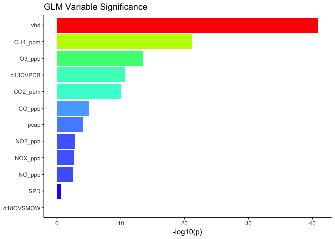
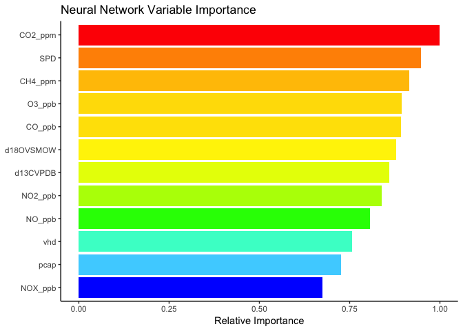

R Machine Learning in Air Quality Science
================

Ben Fasoli

Last Updated: 2018-02-26

Introduction
============

I developed this tutorial as an excuse to play with a really interesting dataset and demonstrate a workflow for others with similar projects. I don't claim to be an expert and this document was as much for my benefit as yours.

The dataset
-----------

Measurements were made at the William Browning Building at the University of Utah. A number of tracers were sampled including CO<sub>2</sub>, CH<sub>4</sub>, O<sub>3</sub>, CO, NO<sub>*x*</sub>, NO, NO<sub>2</sub>, PM<sub>2.5</sub> (MC), *δ*<sub>13</sub>*C*, and *δ*<sub>18</sub>*O*. We also include wind speed as well as valley heat deficit as proxies for meteorological conditions. These are all represented as continuous variables.

Let's load the package dependencies and data. The data is compressed in a serialized object for use in R (.rds) and contains a data frame of observations.

``` r
library(tidyverse)
library(uataq)

wbb <- readRDS('wbb_aggregated.rds')
str(wbb)
```

    ## Classes 'tbl_df', 'tbl' and 'data.frame':    1513 obs. of  13 variables:
    ##  $ Time     : POSIXct, format: "2015-12-28 07:00:00" "2015-12-28 08:00:00" ...
    ##  $ CO2_ppm  : num  477 459 461 469 478 ...
    ##  $ CH4_ppm  : num  2.17 2.14 2.15 2.15 2.17 ...
    ##  $ O3_ppb   : num  2.14 6.27 7.15 4.26 2.07 ...
    ##  $ CO_ppb   : num  284 178 156 163 204 ...
    ##  $ NOX_ppb  : num  45.7 38.9 33 38.4 46.4 ...
    ##  $ NO_ppb   : num  8.64 5.25 1.75 3.97 9.24 ...
    ##  $ NO2_ppb  : num  37.4 34.1 31.8 34.9 37.6 ...
    ##  $ MC       : num  NaN NaN NaN NaN NaN NaN NaN NaN NaN NaN ...
    ##  $ d13CVPDB : num  -12.2 NaN NaN NaN NaN ...
    ##  $ d18OVSMOW: num  38.5 NaN NaN NaN NaN ...
    ##  $ vhd      : num  NaN NaN NaN NaN NaN ...
    ##  $ SPD      : num  0.64 1.09 1.06 0.68 0.33 0.5 0.5 0.14 0.5 0.12 ...

Let's look at the distributions within the variables.

``` r
wbb %>%
  select(-Time) %>%
  gather(key, value) %>%
  na.omit() %>%
  ggplot(aes(x = value)) +
  geom_density() +
  facet_wrap(~ key, scales = 'free') +
  labs(x = NULL, y = NULL) +
  theme_classic()
```


From this, we can see

1.  Many variables have a "background" signal represented by a minimum value (or maximum for negative values such as `d13CVPDB`).
2.  We will need to standardize the scale between variables to remove the background signal and prevent some variables to be more heavily weighted in various models.
3.  Many of the species densities show the maximum density near the background signal.
4.  Many of the species densities show a secondary maxima at higher atmospheric concentrations.

Valley Heat Deficit
-------------------

Valley heat deficit (VHD) is a thermodynamic quantity that acts as a proxy for atmospheric stability within the valley. In the Salt Lake Valley, a valley heat deficit of 4 MJ m<sup>−2</sup> indicates a persistent cold air pool (PCAP) event, during which time the atmospheric concentrations of many measured air quality species often increase. We will add a new column to our data isolating these periods of time and cumulatively summing the VHD values while they are over this threshold to provide an independent estimate of the duration and strength of the PCAP event.

``` r
# New column pcap for the vhd values > 4
wbb$pcap <- with(wbb, ifelse(vhd > 4, vhd, 0))

# Run length encoding to group sequential non-na pcap values
run <- with(wbb, rle(pcap > 0))
run$values <- 1:length(run$values)
wbb$pcap_group <- inverse.rle(run)

# Cumulatively sum vhd values in the pcap column for each pcap_group
wbb <- wbb %>%
  group_by(pcap_group) %>%
  mutate(pcap = cumsum(pcap)) %>%
  ungroup()

# Drop our grouping column
wbb$pcap_group <- NULL
```

`wbb$pcap` now represents the cumulative sum of VHD within groups of VHD &gt; 4.

Final cleaning
--------------

Lastly, there is missing data in the dataset due to instrument outages or long sampling intervals. For our purposes, we will fill the missing values by interpolating over the missing periods. We remove outages that cannot be reliably interpolated (e.g. the beginning or end of our dataset).

``` r
# Interpolate NA values with uataq::na_interp()
wbb <- wbb %>%
  mutate_all(na_interp, x = wbb$Time) %>%
  na.omit()

# Standardize independent variables and convert back to a data frame
scale_mask <- !colnames(wbb) %in% c('Time', 'MC')
scaling_matrix <- scale(wbb[, scale_mask])
wbb[, scale_mask] <- data.frame(scaling_matrix)
str(wbb)
```

    ## Classes 'tbl_df', 'tbl' and 'data.frame':    1223 obs. of  14 variables:
    ##  $ Time     : POSIXct, format: "2016-01-04 21:00:00" "2016-01-04 22:00:00" ...
    ##  $ CO2_ppm  : num  1.017 0.197 0.288 0.964 1.669 ...
    ##  $ CH4_ppm  : num  1.91 1.26 1.25 1.69 2.11 ...
    ##  $ O3_ppb   : num  -0.604 -0.315 -0.572 -1.359 -1.507 ...
    ##  $ CO_ppb   : num  -0.405 -1.033 -0.747 0.368 0.925 ...
    ##  $ NOX_ppb  : num  1.507 0.387 0.396 1.032 1.654 ...
    ##  $ NO_ppb   : num  1.427 0.159 -0.168 0.126 1.013 ...
    ##  $ NO2_ppb  : num  1.268 0.505 0.835 1.669 1.921 ...
    ##  $ MC       : num  47.7 35 28.8 29 27.5 ...
    ##  $ d13CVPDB : num  -3.82 -3.36 -2.89 -2.43 -1.96 ...
    ##  $ d18OVSMOW: num  -3.45 -3.08 -2.72 -2.35 -1.98 ...
    ##  $ vhd      : num  1.36 1.3 1.25 1.19 1.1 ...
    ##  $ SPD      : num  -0.247 -0.132 -0.123 -0.485 -0.99 ...
    ##  $ pcap     : num  2.17 2.19 2.22 2.24 2.27 ...
    ##  - attr(*, "na.action")=Class 'omit'  Named int [1:290] 1 2 3 4 5 6 7 8 9 10 ...
    ##   .. ..- attr(*, "names")= chr [1:290] "1" "2" "3" "4" ...

Modeling
========

Let's test some models. Ultimately, the goal is to predict the PM<sub>2.5</sub> mass concentration (MC) as this is the largest health consideration during these events. We need to split our dataset into training and testing subsets to validate the model results. The `boot` package contains many functions for [bootstrapping](https://en.wikipedia.org/wiki/Bootstrapping_(statistics)) and [k-fold cross validation](https://en.wikipedia.org/wiki/Cross-validation_(statistics)#k-fold_cross-validation) that are useful for estimating confidence intervals, optimizing the [bias-variance tradeoff](https://en.wikipedia.org/wiki/Bias–variance_tradeoff), and prevent overfitting of the model.

Training dataset
----------------

To train our models, we will want to remove the time of the observations and standardize the tracers that we will use as independent variables for the model.

``` r
# Set random seed for results to be reproducible
set.seed(1962)
idx <- sample.int(nrow(wbb), floor(0.8 * nrow(wbb)))

# Subset the WBB dataset to produce training and evaluation data
train <- wbb[idx, ]
test <- wbb[-idx, ]

# Remove time as an independent variable in model training
train$Time <- NULL
```

Generalized linear model
------------------------

Generalized linear models are extensions of ordinary linear regression, introducing a link function that enables the response variable to have an error distribution that does not follow a normal distribution. In our case, we will assume the error to follow a gaussian distribution similar to an ordinary linear regression.

We use k-fold cross validation to ensure that the model is generalized for predicting data outside of the training dataset. k-fold cross validation splits the dataset into *k* equally sized subsets (folds). *k* − 1 subsets are then used to repeatedly train the model and evaluate the results using the remaining subset. These results can tell us the predictive power of our model.

``` r
mod_glm <- glm(MC ~ ., data = train)
summary(mod_glm)
```

    ## 
    ## Call:
    ## glm(formula = MC ~ ., data = train)
    ## 
    ## Deviance Residuals: 
    ##      Min        1Q    Median        3Q       Max  
    ## -24.5725   -4.1444   -0.3602    4.1743   23.1556  
    ## 
    ## Coefficients:
    ##               Estimate Std. Error t value Pr(>|t|)    
    ## (Intercept)   16.37496    0.21840  74.976  < 2e-16 ***
    ## CO2_ppm        6.14610    0.94002   6.538 1.01e-10 ***
    ## CH4_ppm        4.49366    0.45648   9.844  < 2e-16 ***
    ## O3_ppb         5.20510    0.67769   7.681 3.88e-14 ***
    ## CO_ppb         2.56509    0.57302   4.476 8.50e-06 ***
    ## NOX_ppb     -284.00493   91.10705  -3.117 0.001879 ** 
    ## NO_ppb       149.16587   49.47784   3.015 0.002639 ** 
    ## NO2_ppb      163.72969   52.29741   3.131 0.001796 ** 
    ## d13CVPDB      -3.40983    0.50262  -6.784 2.03e-11 ***
    ## d18OVSMOW     -0.03452    0.49056  -0.070 0.943919    
    ## vhd            5.64520    0.39775  14.193  < 2e-16 ***
    ## SPD           -0.31588    0.27059  -1.167 0.243357    
    ## pcap           1.44829    0.37086   3.905 0.000101 ***
    ## ---
    ## Signif. codes:  0 '***' 0.001 '**' 0.01 '*' 0.05 '.' 0.1 ' ' 1
    ## 
    ## (Dispersion parameter for gaussian family taken to be 46.58536)
    ## 
    ##     Null deviance: 260100  on 977  degrees of freedom
    ## Residual deviance:  44955  on 965  degrees of freedom
    ## AIC: 6547.1
    ## 
    ## Number of Fisher Scoring iterations: 2

We extract the cross-validation estimate for the total prediction error and calculate the [root mean square error (RMSE)](https://en.wikipedia.org/wiki/Root-mean-square_deviation), which is a measure of how far off our model is.

``` r
library(boot)
cv_glm <- cv.glm(train, mod_glm, K = 6)
str(cv_glm)
```

    ## List of 4
    ##  $ call : language cv.glm(data = train, glmfit = mod_glm, K = 6)
    ##  $ K    : num 6
    ##  $ delta: num [1:2] 48 47.9
    ##  $ seed : int [1:626] 403 354 417272049 -1877578914 2004768546 261671869 595105114 -1773373059 1226983683 -1818957948 ...

``` r
# The second component of cv_glm$delta gives the adjusted cross-validation error estimate
glm_rmse <- sqrt(cv_glm$delta[2])
glm_rmse
```

    ## [1] 6.917741

``` r
# Similarly we can use the model residuals to calculate RMSE
pred_glm <- predict(mod_glm)
sqrt(mean((train$MC - pred_glm)^2))
```

    ## [1] 6.779832

We can get a (very) rough estimate of the importance of each variable using the *p* values on the regression coefficients.

``` r
importance_glm <- summary(mod_glm)$coefficients[ ,'Pr(>|t|)'] %>%
  (function(x) data_frame(Feature = names(x), P = x)) %>%
  filter(Feature != '(Intercept)') %>%
  mutate(lP = -log10(P))
ggplot(data = importance_glm, aes(x = Feature, y = lP, fill = lP)) +
  geom_bar(stat = 'identity') +
  scale_x_discrete(limits = arrange(importance_glm, lP)$Feature) +
  scale_fill_gradientn(colors = c('blue', 'cyan', 'green', 'yellow', 'orange', 'red'),
                       guide = F) +
  coord_flip() +
  labs(x = NULL, y = '-log10(p)', title = 'GLM Variable Significance') +
  theme_classic()
```



Random forest
-------------

Decision trees are a popular method for predictive modeling and solving classification problems but can be applied to predict continuous variables as well. While decision trees are easy to interpret/visualize and fast to compute, they often prone to overfitting as the tree grows larger.

Random forests are constructed by growing a forest (ensemble) of independent classification and regression trees. These trees allow us to minimize error due to bias and variance by calculating a large number of trees, limiting overoverfitting by not depending on any individual tree and reducing bias and variance errors. Trees are grown by varying the subset of the data used to train the model and by reducing the number of independent variables given to any individual tree, forcing each tree to solve a unique and varying problem. Summarizations of the forest can be used to give us a more robust result than a single decision tree.

``` r
library(randomForest)

mod_rf <- randomForest(MC ~ ., data = train, ntree = 1000, importance = T)
```

Random forests allow us to easily examine the importance of each independent variable on the dependent variable in the model. The model provides percent increase in mean squared error (MSE) as a result of permuting each independent variable. Thus, the variables that have the largest impact on the model have the largest percent increase in MSE.

``` r
importance_rf <- data_frame(Feature = rownames(importance(mod_rf)),
                            PctIncMSE = importance(mod_rf)[, 1])
ggplot(importance_rf, aes(x = Feature, y = PctIncMSE, fill = PctIncMSE)) +
  geom_bar(stat = 'identity') +
  scale_x_discrete(limits = arrange(importance_rf, PctIncMSE)$Feature) +
  scale_fill_gradientn(colors = c('blue', 'cyan', 'green', 'yellow', 'orange', 'red'),
                       guide = F) +
  coord_flip() +
  labs(x = NULL, y = '% Increase MSE', title = 'Random Forest Variable Importance') +
  theme_classic()
```


In random forests, there is no need for cross-validation to estimate model error. Trees provide the [out of bag (OOB)](https://en.wikipedia.org/wiki/Out-of-bag_error) error estimate as a metric to evaluate the model. We can calculate the RMSE using the residuals from the model.

``` r
pred_rf <- predict(mod_rf)
sqrt(mean((train$MC - pred_rf)^2))
```

    ## [1] 4.356564

Alternatively, `randomForest` gives us the MSE of each tree. We can get a rough estimate for RMSE using the mean of the tree MSE values.

``` r
rf_rmse <- mean(sqrt(mod_rf$mse))
rf_rmse
```

    ## [1] 4.428228

Gradient boosting
-----------------

Gradient boosting is a method of starting with a "weak learner", or an estimate of the model result that is only slightly better than random chance (e.g. mean, decision tree, regression), and improving on it until a loss function (often the mean squared error) is optimized. [Boosting](https://en.wikipedia.org/wiki/Boosting_(machine_learning)) is the idea of combining an ensemble of weak learners to create a single strong learner. [Gradient descent](https://en.wikipedia.org/wiki/Gradient_descent) uses an interatively improved model to minimize the loss function.

Gradient boosting is an ensemble method that iteratively combines weak learners into a single strong learner. In other words, it combines multiple inferior models to produce a robust result. At each iteration, a new model is calculated to best account for the residuals from the previous model (somewhat similar to [principle component analysis](https://en.wikipedia.org/wiki/Principal_component_analysis) but without the constraint of orthogonality). Each new model seeks to correct the error in the previous model. Imagine a random forest as above but now we grow the trees one at a time. When a tree finishes growing, a new tree starts and tries to minimize the total error in the forest.

Generally, gradient boosting

1.  Fits a model to the training data.
2.  Calculates the residuals of the fitted model.
3.  Fits a new model to the residuals and add this new model to the existing model (possibly with a weighting function).
4.  Return to step 2.

The [extreme gradient boosting](https://github.com/dmlc/xgboost) implementation consistently wins data science and machine learning competitions (over half of the winning solutions on Kaggle) and has interfaces available for R and Python (among many others).

``` r
library(xgboost)

dtrain <- xgb.DMatrix(as.matrix(select(train, -MC)), label = train$MC)
dtest <- xgb.DMatrix(as.matrix(select(test, -MC, -Time)), label = test$MC)

param <- list(objective = 'reg:linear', max_depth = 6, nthread = 4)
```

`xgboost` includes methods for cross validation of the model which is useful for deciding how many rounds the model needs to iterate to minimize the error. By monitoring the RMSE of the test folds for each iteration, we can tell the model to stop after several rounds during which we haven't seen any improvement.

``` r
xgb_cv <- xgb.cv(param, dtrain, nrounds = 1000,
                 early_stopping_rounds = 10, nfold = 6, verbose = F)
xgb_cv
```

    ## ##### xgb.cv 6-folds
    ##  iter train_rmse_mean train_rmse_std test_rmse_mean test_rmse_std
    ##     1      16.5080575     0.22548421      16.539773     1.4325227
    ##     2      12.0466475     0.16072269      12.322060     1.1327824
    ##     3       8.9195657     0.11147316       9.483862     0.9668260
    ##     4       6.7125742     0.07878720       7.620834     0.8093885
    ##     5       5.1613318     0.05797445       6.433779     0.7030936
    ##     6       4.0553660     0.04460947       5.680803     0.6076244
    ##     7       3.2816393     0.04341231       5.235104     0.5297490
    ##     8       2.7280642     0.04544028       4.956661     0.4851584
    ##     9       2.3449802     0.03977735       4.798172     0.4031762
    ##    10       2.0706257     0.03878046       4.673844     0.3788747
    ##    11       1.8641720     0.04531771       4.624014     0.3583513
    ##    12       1.7115550     0.04413918       4.585592     0.3487382
    ##    13       1.5981678     0.04520150       4.566274     0.3486894
    ##    14       1.5087275     0.04213684       4.543622     0.3353727
    ##    15       1.4238298     0.04515882       4.534583     0.3308994
    ##    16       1.3450183     0.03693433       4.524469     0.3329892
    ##    17       1.2930720     0.03484655       4.501362     0.3215766
    ##    18       1.2440070     0.04043959       4.493177     0.3141889
    ##    19       1.2036827     0.04177300       4.489201     0.3113510
    ##    20       1.1573513     0.04018572       4.498910     0.3058221
    ##    21       1.1246838     0.04055412       4.495055     0.3028323
    ##    22       1.0843688     0.02942511       4.491063     0.3051690
    ##    23       1.0610838     0.03682016       4.485874     0.3041648
    ##    24       1.0225462     0.03493065       4.477860     0.3105788
    ##    25       0.9864282     0.04292524       4.477218     0.3086636
    ##    26       0.9659263     0.02736162       4.475032     0.3095886
    ##    27       0.9454995     0.03294494       4.475771     0.3102712
    ##    28       0.9181233     0.02943689       4.476494     0.3123336
    ##    29       0.8922917     0.03147040       4.478277     0.3059425
    ##    30       0.8655203     0.02388055       4.480150     0.3094435
    ##    31       0.8390323     0.02959707       4.479963     0.3078240
    ##    32       0.8156343     0.03321757       4.481226     0.3060604
    ##    33       0.7802553     0.04289646       4.484104     0.3104866
    ##    34       0.7593177     0.03727413       4.487075     0.3121352
    ##    35       0.7385563     0.03571268       4.487280     0.3136032
    ##    36       0.7204992     0.03725858       4.489591     0.3113199
    ##  iter train_rmse_mean train_rmse_std test_rmse_mean test_rmse_std
    ## Best iteration:
    ##  iter train_rmse_mean train_rmse_std test_rmse_mean test_rmse_std
    ##    26       0.9659263     0.02736162       4.475032     0.3095886

``` r
mod_gb <- xgb.train(param, dtrain, nrounds = xgb_cv$best_ntreelimit)

importance_gb <- xgb.importance(colnames(dtrain), mod_gb, as.matrix(select(train, -MC)),
                                label = train$MC)
importance_gb_sum <- importance_gb %>%
  group_by(Feature) %>%
  summarize_all(funs(sum(as.numeric(.), na.rm = T)))
ggplot(data = importance_gb_sum, aes(x = Feature, y = Gain, fill = Gain)) +
  geom_bar(stat = 'identity') +
  scale_x_discrete(limits = arrange(importance_gb_sum, Gain)$Feature) +
  scale_fill_gradientn(colors = c('blue', 'cyan', 'green', 'yellow', 'orange', 'red'),
                       guide = F) +
  coord_flip() +
  labs(x = NULL, y = 'Total Gain', title = 'Gradient Boosting Variable Importance') +
  theme_classic()
```


Similar to the first two models, we can try to calculate the RMSE of the residuals.

``` r
pred_gb <- predict(mod_gb, dtrain)
sqrt(mean((train$MC - pred_gb)^2))
```

    ## [1] 1.111908

While this number looks small, it is not a good estimate for uncertainty in the predictive power of the model since the model is likely overfit to the training data. The RMSE of the cross validation test folds provide the best estimate of predictive uncertainty at this point.

Neural Network
--------------

[Neural networks](https://en.wikipedia.org/wiki/Artificial_neural_network) are a means of machine learning that are exceptionally popular in image processing and are becoming more utilized in predicting continuous variables. The technique is modeled loosely after the human brain and uses the concept of neurons or nodes to transmit information. These [deep learning](https://en.wikipedia.org/wiki/Deep_learning) techniques are well suited to [solving classification problems](https://en.wikipedia.org/wiki/Feature_learning) (*cow* or *not a cow*) due to their ability to model complex non-linear relationships. The learning framework is typically organized into a minimum of 3 layers.

1.  *Input layer* containing input data which presents a pattern for the neural network to be trained on
2.  *Hidden layer(s)* which contains neurons that interact with multiple neurons in the layer prior and after, transmitting data forward and weighting the importance of previous neurons to optimize a loss function. Typically multiple hidden layers are used (3-5 is fairly normal) with more layers used to solve more complex problems
3.  *Output layer* contains

Training a neural network modifies the weighting of how neurons interact with one another to optimize a loss function, such as the [mean squared error](https://en.wikipedia.org/wiki/Mean_squared_error).

[H2O](https://www.h2o.ai) is a popular open-source machine learning platform for big-data analysis with interfaces available for R and Python (among many others). To apply this to our dataset, we need to initialize a H2O instance on our machine and convert the data frames into an object H2O knows how to work with.

``` r
library(h2o)
h2o.init()
```

    ## 
    ## H2O is not running yet, starting it now...
    ## 
    ## Note:  In case of errors look at the following log files:
    ##     /tmp/Rtmp6uE8fV/h2o_benfasoli_started_from_r.out
    ##     /tmp/Rtmp6uE8fV/h2o_benfasoli_started_from_r.err
    ## 
    ## 
    ## Starting H2O JVM and connecting: . Connection successful!
    ## 
    ## R is connected to the H2O cluster: 
    ##     H2O cluster uptime:         1 seconds 619 milliseconds 
    ##     H2O cluster version:        3.16.0.2 
    ##     H2O cluster version age:    2 months and 26 days  
    ##     H2O cluster name:           H2O_started_from_R_benfasoli_gbj512 
    ##     H2O cluster total nodes:    1 
    ##     H2O cluster total memory:   6.94 GB 
    ##     H2O cluster total cores:    4 
    ##     H2O cluster allowed cores:  4 
    ##     H2O cluster healthy:        TRUE 
    ##     H2O Connection ip:          localhost 
    ##     H2O Connection port:        54321 
    ##     H2O Connection proxy:       NA 
    ##     H2O Internal Security:      FALSE 
    ##     H2O API Extensions:         AutoML, XGBoost, Algos, Core V3, Core V4 
    ##     R Version:                  R version 3.4.3 (2017-11-30)

``` r
train_h2o <- as.h2o(train)
```

    ## 
      |                                                                       
      |                                                                 |   0%
      |                                                                       
      |=================================================================| 100%

``` r
test_h2o <- as.h2o(test[,setdiff(names(test), 'Time')])
```

    ## 
      |                                                                       
      |                                                                 |   0%
      |                                                                       
      |=================================================================| 100%

We can then train a model using three hidden layers consisting of 100 neurons each and cross-validate the results using 5 folds. Epochs describe the number of times that the neural network is presented with the entire dataset and should be determined by optimizing the [bias-variance tradeoff](https://en.wikipedia.org/wiki/Bias–variance_tradeoff) and validated using methods such as k-fold cross validation. Increasing the number of epochs improves the fit to the training dataset at the risk of over-fitting the model to the training dataset.

``` r
mod_nn <- h2o.deeplearning(x = setdiff(names(train), 'MC'),
                           y = 'MC',
                           training_frame = train_h2o,
                           standardize = T,
                           hidden = c(100, 100, 100),
                           nfolds = 5,
                           epochs = 600)
```

``` r
mod_nn@model$cross_validation_metrics_summary
```

    ## Cross-Validation Metrics Summary: 
    ##                              mean          sd cv_1_valid cv_2_valid
    ## mae                      2.958362  0.14990753  2.8914003  2.6821103
    ## mean_residual_deviance  18.004482   1.9232517  16.034834  16.247316
    ## mse                     18.004482   1.9232517  16.034834  16.247316
    ## r2                     0.93161047 0.008493762   0.941863 0.94487786
    ## residual_deviance       18.004482   1.9232517  16.034834  16.247316
    ## rmse                    4.2320952  0.21662208  4.0043516   4.030796
    ## rmsle                   0.3273886 0.025973711        NaN 0.29498607
    ##                        cv_3_valid cv_4_valid cv_5_valid
    ## mae                     2.9136574  3.3349204  2.9697225
    ## mean_residual_deviance  17.498392  23.346376  16.895494
    ## mse                     17.498392  23.346376  16.895494
    ## r2                     0.92302936 0.91284764  0.9354346
    ## residual_deviance       17.498392  23.346376  16.895494
    ## rmse                     4.183108   4.831809   4.110413
    ## rmsle                   0.3257697 0.37915942 0.30963928

We can extract the variable importance derived from the weighting of the neurons.

``` r
importance_nn <- h2o.varimp(mod_nn)
ggplot(data = importance_nn, aes(x = variable, y = relative_importance, fill = relative_importance)) +
  geom_bar(stat = 'identity') +
  scale_x_discrete(limits = arrange(importance_nn, relative_importance)$variable) +
  scale_fill_gradientn(colors = c('blue', 'cyan', 'green', 'yellow', 'orange', 'red'),
                       guide = F) +
  coord_flip() +
  labs(x = NULL, y = 'Relative Importance', title = 'Neural Network Variable Importance') +
  theme_classic()
```



Similar to the first two models, we can try to calculate the RMSE of the residuals.

``` r
pred_nn <- as.vector(h2o.predict(mod_nn, 
                                 as.h2o(train_h2o[,setdiff(names(train_h2o), 'Time')])))
```

    ## 
      |                                                                       
      |                                                                 |   0%
      |                                                                       
      |=================================================================| 100%

``` r
sqrt(mean((train$MC - pred_nn)^2))
```

    ## [1] 0.7991955

Similar to the gradient boosting results, this number looks small but it is not a good estimate for uncertainty in the predictive power of the model since the model is likely overfit to the training data - the difference between this RMSE and the cross validation results is a clear indicator of this.

Model evaluation
================

Up to now, we have both trained and evaluated our model using the training dataset. While we are able to estimate the model error using robust methods such as k-fold cross validation, evaluating our separate test dataset allows us to validate our uncertainty estimates. To do this, we need to execute our models on our test dataset.

``` r
test$GLM <- predict(mod_glm, test)
test$`Random Forest` <- predict(mod_rf, test)
test$`Gradient Boosting` <- predict(mod_gb, dtest)
test$`Neural Network` <- as.vector(h2o.predict(mod_nn, test_h2o))
```

    ## 
      |                                                                       
      |                                                                 |   0%
      |                                                                       
      |=================================================================| 100%

``` r
# Calculate model summary statistics
fit_glm <- lm(MC ~ GLM, data = test)
fit_rf <- lm(MC ~ `Random Forest`, data = test)
fit_gb <- lm(MC ~ `Gradient Boosting`, data = test)
fit_nn <- lm(MC ~ `Neural Network`, data = test)

rmse <- function(mod) {sqrt(mean(resid(mod)^2))}
fit_stats <- rbind(r.squared = c(glm = summary(fit_glm)$r.squared,
                                 rf = summary(fit_rf)$r.squared,
                                 gb = summary(fit_gb)$r.squared,
                                 nn = summary(fit_gb)$r.squared),
                   rmse = c(rmse(fit_glm),
                            rmse(fit_rf),
                            rmse(fit_gb),
                            rmse(fit_nn))) %>%
  round(2)
fit_stats
```

    ##            glm   rf   gb   nn
    ## r.squared 0.79 0.89 0.89 0.89
    ## rmse      6.61 4.86 4.85 4.38

``` r
test %>%
  select(Time, Observed = MC, GLM, 'Random Forest', 'Gradient Boosting', 'Neural Network') %>%
  gather(key, value, -Time) %>%
  ggplot(aes(x = Time, y = value, color = key)) +
  geom_line(alpha = 0.5) +
  geom_point(alpha = 0.5) +
  labs(x = NULL, y = expression(PM[2.5]), title = 'Model Comparison Timeseries',
       color = NULL) +
  theme_classic()
```


``` r
test %>%
  select(MC, GLM, 'Random Forest', 'Gradient Boosting', 'Neural Network') %>%
  gather(key, value, -MC) %>%
  ggplot(aes(x = MC, y = value, color = key)) +
  geom_abline(slope = 1, intercept = 0) +
  geom_point(alpha = 0.5) +
  geom_smooth(method = 'lm', fill = NA) +
  labs(x = 'Observed', y = 'Modeled', title = 'Model Comparison', color = NULL) +
  theme_classic()
```


``` r
h2o.shutdown(F)
```

    ## [1] TRUE

Final thoughts
==============

1.  Random forests, gradient boosting, and neural networks perform similarly well. The GLM produced a mean error 36% higher than both learning methods.
2.  The `pcap` variable is more heavily weighted in the random forest and gradient boosted models.
3.  All models agree on the importance of CH<sub>4</sub>, O<sub>3</sub>.
4.  Gradient boosting and neural networks require more knob turning than random forests and could likely be tuned to improve results.
5.  Using the booster set to `gbtree` produces better results but runs much slower than `gblinear`. Increasing tree depth strongly overfits the model to the training data but does not extend well to the test data.
6.  Using a higher number of epochs improves neural network results at the risk of overfitting to the training data.
